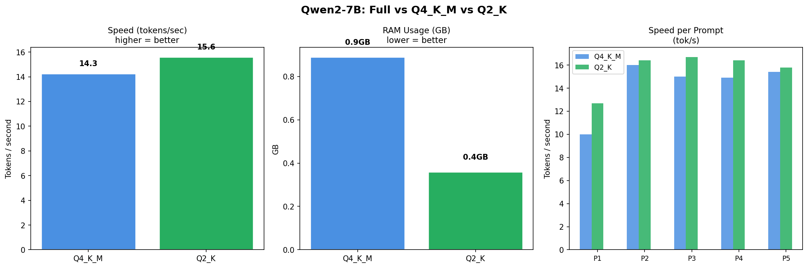

# Qwentize.cpp 🥷👾

> Started April 19, 2026

I wanted to actually understand quantization — not just read about it. So I grabbed llama.cpp, pulled Qwen3-8B off HuggingFace, and ran the same prompts through Q4\_K\_M and Q2\_K to see what breaks.

Inspired by [Nunchaku](https://github.com/mit-han-lab/nunchaku) (which does something similar but for diffusion models). This is for LLMs.

[@douzog](https://github.com/douzog) 🥷👾

---

## What's in here

Three quantization levels, same model, same prompts:

| Model               | Bits   | Size  | Speed    |
| ------------------- | ------ | ----- | -------- |
| Qwen3-8B F16 (full) | 16-bit | ~16 GB | Slowest  |
| Qwen3-8B Q4\_K\_M   | 4-bit  | ~5 GB  | Fast     |
| Qwen3-8B Q2\_K      | 2-bit  | ~3 GB  | Fastest  |

For each run I track speed (tok/s), latency, RAM, and what the model actually says.

---

## Results



Q2\_K loads faster and uses way less RAM (~0.36 GB vs ~0.89 GB), but the responses are noticeably worse on anything that requires reasoning. Q4\_K\_M is the sweet spot.

---

## Why not Nunchaku?

Nunchaku targets diffusion models (FLUX, SANA). This is for text generation — different tools for different jobs.

---

## Setup

**You'll need:** Python 3.10+, cmake, ~20 GB disk space.

### 1. Build llama.cpp

```bash
git clone https://github.com/ggml-org/llama.cpp.git
cd llama.cpp

# Apple Silicon
cmake -B build -DGGML_METAL=ON
cmake --build build --config Release -j$(nproc)

# NVIDIA GPU
# cmake -B build -DGGML_CUDA=ON
# cmake --build build --config Release -j$(nproc)
```

### 2. Get the model and quantize

```bash
hf download Qwen/Qwen3-8B --local-dir ./models/qwen3-8b

pip install -r requirements.txt
python convert_hf_to_gguf.py models/qwen3-8b --outfile ../qwen3-8b-f16.gguf

./build/bin/llama-quantize ../qwen3-8b-f16.gguf ../qwen3-8b-q4km.gguf Q4_K_M
./build/bin/llama-quantize ../qwen3-8b-f16.gguf ../qwen3-8b-q2k.gguf  Q2_K
```

You should end up with three files:

```
qwen3-8b-f16.gguf    (~16 GB)
qwen3-8b-q4km.gguf   (~5 GB)
qwen3-8b-q2k.gguf    (~3 GB)
```

### 3. Run the benchmark

```bash
pip install llama-cpp-python psutil matplotlib numpy
jupyter notebook qwen_benchmark.ipynb
```

---

## What Q4\_K\_M actually means

```
Q  4  _K_M
│  │   │ │
│  │   │ └── M = Medium (balanced within the K family)
│  │   └──── K = K-quant method (smarter than basic Q4)
│  └──────── 4 = 4 bits per weight
└─────────── Q = Quantized
```

The Q2\_K tradeoff in practice:

```
Q4_K_M  →  "The mitochondria is the powerhouse of the cell because..."
Q2_K    →  "The mitochondria powerhouse cell energy ATP..."
```

It's ~2× smaller but starts to fall apart on anything complex.

---

## Repo

```
Qwentify/
├── README.md
├── qwen_benchmark.ipynb
├── qwen_benchmark.png
└── qwen_benchmark_results.csv
```

---

## Troubleshooting

| Problem | Fix |
| --- | --- |
| `no such file: ./build/bin/llama-quantize` | cmake build didn't finish — rerun those steps |
| `cmake` not found | `brew install cmake` on Mac, `sudo apt install cmake -y` on Linux |
| OOM during quantization | F16 needs ~18 GB RAM. For 35B you're looking at ~80 GB — just grab a pre-quantized GGUF from HuggingFace |

---

## Links

- [llama.cpp](https://github.com/ggml-org/llama.cpp)
- [Qwen on HuggingFace](https://huggingface.co/Qwen)
- [GGUF spec](https://github.com/ggml-org/ggml/blob/master/docs/gguf.md)
- [Nunchaku](https://github.com/mit-han-lab/nunchaku)
